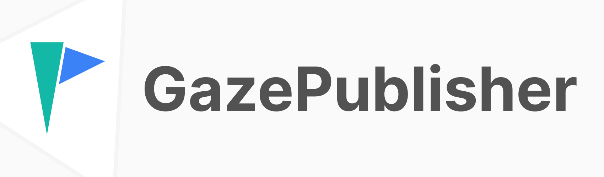

 

GazePublisher is part of Gaze.
GazePublisher is the backend library that is responsible for sending data to [GazeHub](https://github.com/isaaceindhoven/GazeHub).

## Documentation & Installation

[Click here](https://isaaceindhoven.github.io/GazeHub/docs/#/gazepublisher) to go to the full documentation and installation instruction for Gaze and GazePublisher.